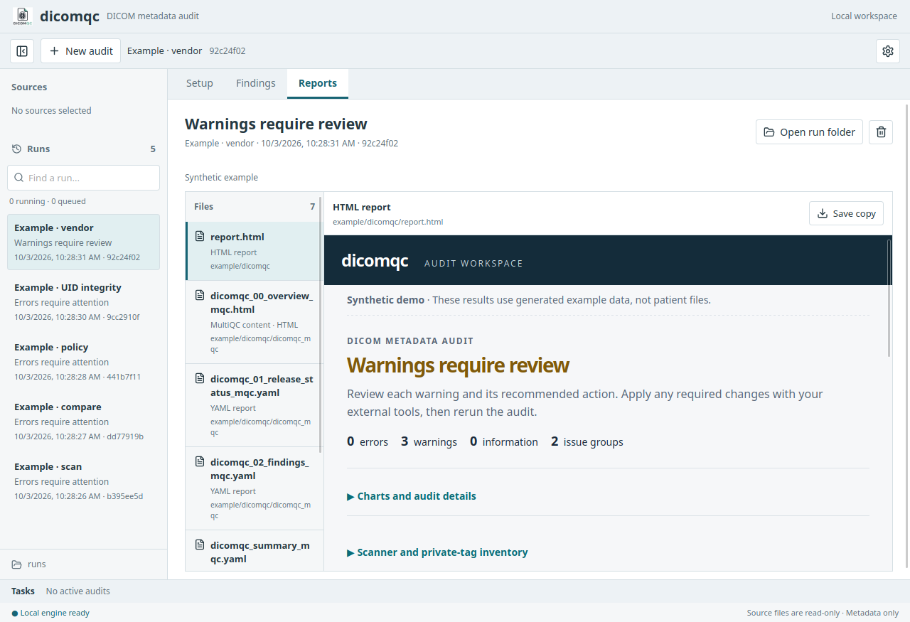

<div align="center">
  <a href="https://github.com/CNAG-Biomedical-Informatics/dicomqc">
    
  </a>
  <p><em>Audit de-identified DICOM metadata for privacy risks</em></p>
</div>

[](https://github.com/CNAG-Biomedical-Informatics/dicomqc/actions/workflows/build-and-test.yml)
[](https://github.com/CNAG-Biomedical-Informatics/dicomqc/actions/workflows/documentation.yml)
[](https://pypi.org/project/dicomqc/)
[](https://pypi.org/project/dicomqc/)
[](LICENSE)

<p align="center">
  <a href="https://cnag-biomedical-informatics.github.io/dicomqc/">📚 Documentation</a> ·
  <a href="https://cnag-biomedical-informatics.github.io/dicomqc/docs/usage/desktop">Desktop app</a> ·
  <a href="https://pypi.org/project/dicomqc/">📦 PyPI</a> ·
  <a href="https://cnag-biomedical-informatics.github.io/dicomqc/docs/usage/quickstart">🧪 Try a demo</a> ·
  <a href="CHANGELOG.md">📝 Changelog</a> ·
  <a href="LICENSE">⚖️ Apache-2.0</a>
</p>

---

**dicomqc** audits de-identified DICOM metadata for privacy risks through a
desktop app or the command line. Both use the same Python audit engine.

It flags identifying fields, unexpected pseudonym formats, private tags, and
unreadable files. It writes HTML, JSON, CSV, and MultiQC-compatible reports.
Findings omit raw tag values; the optional scanner inventory exports observed
labels and must be reviewed before sharing.


dicomqc is **not an anonymizer**. It never modifies original DICOM files. If it
reports required changes, apply them with an external pseudonymization or
anonymization tool and rerun the audit.

## Get started

### Desktop app

Select DICOM files or folders, choose an output folder, and run an audit.
The desktop workspace keeps sources and searchable run history beside
**Setup**, **Findings**, and **Reports** views. Each run has its own output
subfolder, with an HTML preview and report export controls.

**Explore with synthetic data** runs built-in scan, comparison, policy, UID,
and scanner-inventory examples without patient data.



The desktop app currently runs from source; installers are not published.
See [Desktop setup and usage](https://cnag-biomedical-informatics.github.io/dicomqc/docs/usage/desktop).
The app starts its audit service locally; no remote server is required.

### Command line

Install in a Python environment and try the synthetic demo:

```bash
pip install dicomqc
dicomqc demo
```

The demo creates `dicomqc-demo/` with synthetic DICOM files and sample reports.
See the [documentation](https://cnag-biomedical-informatics.github.io/dicomqc/)
for installation options, dataset comparisons, reports, and citation guidance.

## Author

Written by Manuel Rueda. GitHub repository:
<https://github.com/CNAG-Biomedical-Informatics/dicomqc>.

## Copyright and License

Copyright 2026 Manuel Rueda, CNAG.

dicomqc is distributed under the [Apache License 2.0](LICENSE).
