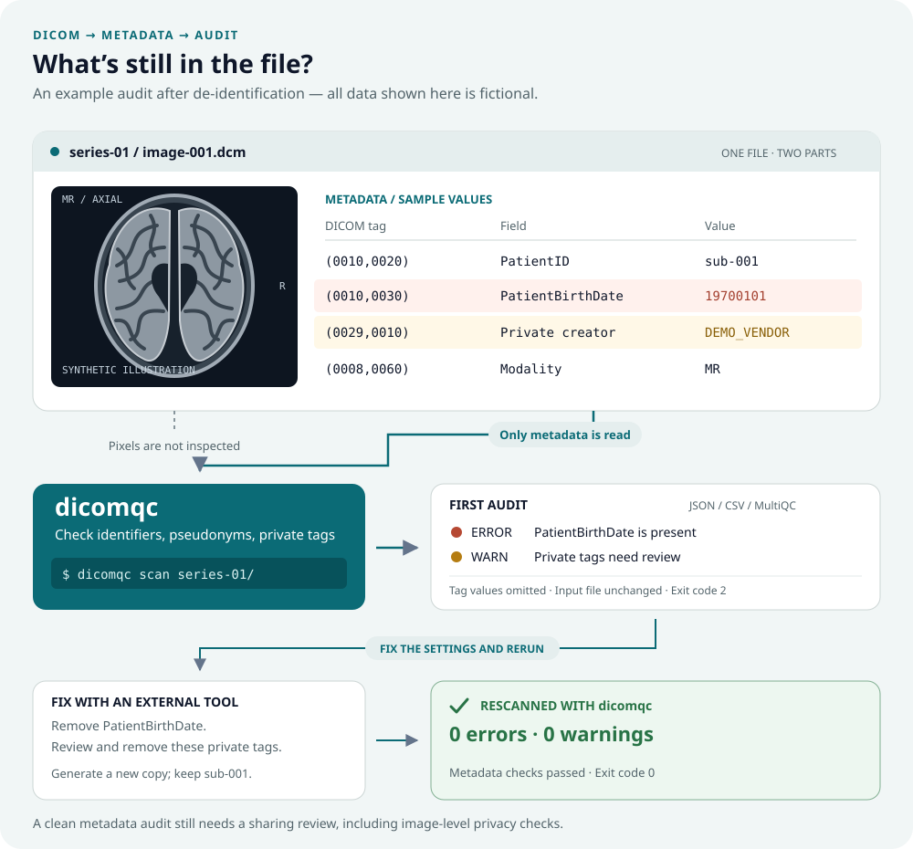

<div align="center">
  <a href="https://github.com/CNAG-Biomedical-Informatics/dicomqc">
    
  </a>
  <p><em>Audit de-identified DICOM metadata for privacy risks</em></p>
</div>

[](https://github.com/CNAG-Biomedical-Informatics/dicomqc/actions/workflows/build-and-test.yml)
[](https://github.com/CNAG-Biomedical-Informatics/dicomqc/actions/workflows/documentation.yml)
[](https://pypi.org/project/dicomqc/)
[](https://pypi.org/project/dicomqc/)
[](LICENSE)

---

**dicomqc** audits de-identified DICOM metadata for privacy risks.

It flags identifying fields, unexpected pseudonym formats, private tags, and
unreadable files. It writes JSON, CSV, and MultiQC-compatible reports without
copying raw DICOM tag values.



**Documentation:** <https://cnag-biomedical-informatics.github.io/dicomqc/>

dicomqc is **not an anonymizer**. It never modifies original DICOM files. If it
reports required changes, apply them with an external pseudonymization or
anonymization tool and rerun the audit.

Pseudonymize the source DICOM files with your chosen tool, then audit the
resulting DICOM files with dicomqc before sharing them.

## Features

- Metadata-only DICOM scanning with `pydicom`
- Built-in research-release checks for direct PHI, pseudonym format, and private tags
- Reports that omit raw DICOM tag values
- JSON and CSV reports for automated workflows and review
- MultiQC custom-content output with a styled example report
- Synthetic DICOM fixtures for reproducible tests and demonstrations
- Fix findings with external tools such as DCMTK, Orthanc, XNAT, or custom scripts

Version 0.1 does not inspect pixels or facial features, or certify compliance
with DICOM PS3.15, BIDS, HIPAA, or GDPR. Configurable policies, standards-specific
checks, plugins, and vendor metadata summaries are planned.

## Installation

Install the release from [PyPI](https://pypi.org/project/dicomqc/) in an
isolated environment:

```bash
python3 -m venv .venv
source .venv/bin/activate
python -m pip install --upgrade pip
python -m pip install dicomqc
dicomqc --version
```

From a source checkout, install the package in editable mode:

```bash
python3 -m pip install -e .
```

Contributors who need the test and coverage tools can install the `test`
optional dependency group:

```bash
python3 -m pip install -e ".[test]"
```

For local remediation workflows, install external DICOM tools separately. For
example, DCMTK provides `dcmodify` and `dcmdump`, but dicomqc itself remains
read-only.

## Quick Start

Generate a complete synthetic DICOM demo and report bundle:

```bash
dicomqc demo
```

This creates `dicomqc-demo/` with synthetic `.dcm` files, `report.json`,
`findings.csv`, and MultiQC custom-content files. The demo includes intentional
findings so you can see how problems appear in the reports.

Run an audit on a directory of candidate release `.dcm` files:

```bash
dicomqc scan study/ --json report.json --csv findings.csv --multiqc
```

Exit codes:

- `0`: no warnings or errors
- `1`: warnings only
- `2`: validation errors or fatal scan failure

## Compare datasets

The source checkout also includes `dicomqc compare` for checking file completeness
and patient pseudonym consistency between source and de-identified datasets:

```bash
dicomqc compare raw_mri/ candidate_mri/ --manifest pairs.csv --json comparison.json
```

The CSV manifest pairs source and output paths explicitly. See
[Compare datasets](docs-site/docs/usage/compare.md) for its format and limitations.
This command is not included in the published v0.1.0 package.

## Reports

| Output | Purpose |
| --- | --- |
| JSON | Complete audit results for automated workflows and record keeping |
| CSV | One row per finding for review and spreadsheet workflows |
| MultiQC | Custom-content summary for projects that aggregate QC reports |

Render the demo with MultiQC, if installed:

```bash
multiqc dicomqc-demo/dicomqc --outdir dicomqc-demo --force
```

Use `examples/multiqc/multiqc_config.yaml` when rendering the demo report if you
want the repository logo and styling in local MultiQC output.

## Documentation

The documentation site lives in `docs-site/` and uses Docusaurus.

```bash
cd docs-site
npm install
npm run build
```

Important docs:

- [Install](https://cnag-biomedical-informatics.github.io/dicomqc/docs/usage/install)
- [Quick start](https://cnag-biomedical-informatics.github.io/dicomqc/docs/usage/quickstart)
- [Reports and MultiQC](https://cnag-biomedical-informatics.github.io/dicomqc/docs/usage/reports)
- [MS MRI workflow](https://cnag-biomedical-informatics.github.io/dicomqc/docs/usage/ms-mri-workflow)
- [Remediation examples](https://cnag-biomedical-informatics.github.io/dicomqc/docs/usage/remediation)
- [Prior work](https://cnag-biomedical-informatics.github.io/dicomqc/docs/about/prior-work)
- [Changelog](https://github.com/CNAG-Biomedical-Informatics/dicomqc/blob/main/CHANGELOG.md)
- [Release process](https://github.com/CNAG-Biomedical-Informatics/dicomqc/blob/main/RELEASING.md)

## Prior Work

Related projects include:

- [`SPMIC-UoN/xnat-dicomqc`](https://github.com/SPMIC-UoN/xnat-dicomqc): an XNAT
  container script for configurable tag-based QC on scan DICOMs.
- [`IUSCA/SQAN`](https://github.com/IUSCA/SQAN): Scalable Quality Assurance for
  Neuroimaging, a broader DICOM metadata ETL and QC verification system.

dicomqc runs locally without XNAT or a data-management platform. Its focus is
auditing metadata after de-identification and saving the results for review.
Like xnat-dicomqc, it checks DICOM tags against rules. xnat-dicomqc supports
project-defined tests in an Excel configuration file; dicomqc v0.1 has one
built-in privacy profile. See the [prior-work comparison](https://cnag-biomedical-informatics.github.io/dicomqc/docs/about/prior-work)
for differences in setup, checks, and reporting.

## Citation

dicomqc is early-stage research software. Until a stable release, archived DOI,
or manuscript is available, cite the repository URL and the exact version or
commit used in your analysis.

## Author

Written by Manuel Rueda. GitHub repository:
<https://github.com/CNAG-Biomedical-Informatics/dicomqc>.

## Copyright and License

Copyright 2026 Manuel Rueda, CNAG.

dicomqc is distributed under the [Apache License 2.0](LICENSE).
